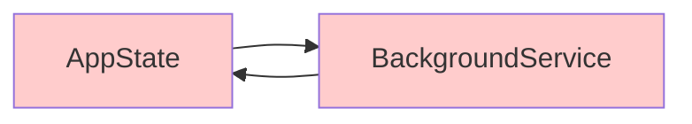
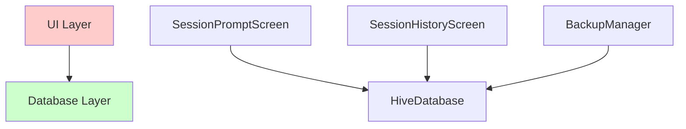
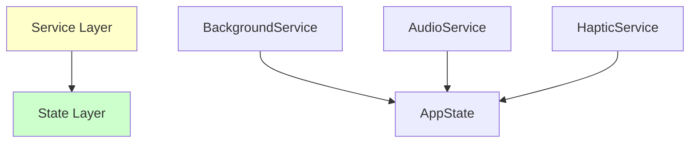

# Component Dependency Analysis

## Overview

This document provides a comprehensive analysis of component dependencies in the SoccerTimeApp Flutter application. It maps all dependencies between services, providers, screens, models, and utilities to identify architectural patterns, tight coupling issues, and potential circular dependencies.

## High-Level Architecture Diagram

```mermaid
graph TB
    subgraph "Entry Point"
        Main[main.dart]
    end
    
    subgraph "State Management"
        AppState[AppState Provider]
    end
    
    subgraph "Database Layer"
        HiveDB[HiveDatabase]
    end
    
    subgraph "Services Layer"
        BackgroundSvc[BackgroundService]
        AudioSvc[AudioService]
        HapticSvc[HapticService]
        FileSvc[FileService]
        PDFSvc[PdfService]
        SessionSvc[SessionService]
        TranslationSvc[TranslationService]
    end
    
    subgraph "UI Layer"
        MainScreen[MainScreen]
        SettingsScreen[SettingsScreen]
        SessionPromptScreen[SessionPromptScreen]
        SessionHistoryScreen[SessionHistoryScreen]
        PlayerTimesScreen[PlayerTimesScreen]
        MatchLogScreen[MatchLogScreen]
        PDFPreviewScreen[PdfPreviewScreen]
        SessionScreen[SessionScreen]
    end
    
    subgraph "Widgets"
        MatchTimer[MatchTimer]
        PlayerButton[PlayerButton]
        PeriodEndDialog[PeriodEndDialog]
        ResizableContainer[ResizableContainer]
    end
    
    subgraph "Models"
        Session[Session Model]
        Player[Player Model]
        MatchLogEntry[MatchLogEntry Model]
        SessionSettings[SessionSettings Model]
    end
    
    subgraph "Utilities"
        AppThemes[AppThemes]
        FormatTime[FormatTime]
        BackupManager[BackupManager]
    end
    
    %% Main dependencies
    Main --> AppState
    Main --> HiveDB
    Main --> BackgroundSvc
    Main --> MainScreen
    
    %% AppState dependencies
    AppState --> Session
    AppState --> Player
    AppState --> MatchLogEntry
    AppState --> HiveDB
    AppState --> TranslationSvc
    
    %% Service dependencies
    BackgroundSvc --> AppState
    AudioSvc --> AppState
    HapticSvc --> AppState
    FileSvc --> Session
    PDFSvc --> Session
    PDFSvc --> MatchLogEntry
    SessionSvc --> Session
    
    %% Screen dependencies
    MainScreen --> AppState
    MainScreen --> AudioSvc
    MainScreen --> HapticSvc
    MainScreen --> BackgroundSvc
    MainScreen --> PeriodEndDialog
    SettingsScreen --> AppState
    SettingsScreen --> FileSvc
    SessionPromptScreen --> AppState
    SessionPromptScreen --> HiveDB
    SessionHistoryScreen --> AppState
    SessionHistoryScreen --> HiveDB
    PlayerTimesScreen --> AppState
    PlayerTimesScreen --> PDFSvc
    MatchLogScreen --> AppState
    
    %% Widget dependencies
    MatchTimer --> AppState
    PlayerButton --> AppState
    PlayerButton --> Player
    PlayerButton --> Session
    PeriodEndDialog --> AppState
    
    %% Utility dependencies
    BackupManager --> HiveDB
    
    %% Model relationships
    Session --> Player
    Session --> MatchLogEntry
```

## Detailed Component Dependencies

### 1. Entry Point Layer

#### main.dart
**Imports:**
- `providers/app_state.dart`
- `screens/session_prompt_screen.dart`
- `screens/main_screen.dart`
- `screens/settings_screen.dart`
- `screens/session_history_screen.dart`
- `utils/app_themes.dart`
- `hive_database.dart`
- `services/translation_service.dart`
- `services/background_service.dart`

**Dependencies:**
- Direct dependency on AppState (Provider)
- Direct dependency on HiveDatabase for initialization
- Direct dependency on BackgroundService for initialization
- Route management for all screens

**Issues Identified:**
- ❌ **High coupling**: main.dart directly imports and manages multiple services
- ❌ **Mixed concerns**: Permission handling, database initialization, and UI setup all in main.dart
- ❌ **Error handling**: Custom error suppression may hide real issues

### 2. State Management Layer

#### AppState Provider
**Imports:**
- `../models/session.dart`
- `../models/player.dart`
- `../hive_database.dart`
- `../services/translation_service.dart`
- `../models/match_log_entry.dart`

**Dependencies:**
- Core dependency on all data models
- Direct database access through HiveDatabase
- Translation service integration

**Issues Identified:**
- ⚠️ **Large file**: 1617 lines - exceeds maintainability threshold
- ❌ **God object**: Manages too many responsibilities
- ❌ **Tight coupling**: Direct database access instead of repository pattern

### 3. Database Layer

#### HiveDatabase
**Imports:**
- `package:hive_flutter/hive_flutter.dart`

**Dependencies:**
- No internal dependencies (good isolation)
- Provides data access for AppState and services

**Issues Identified:**
- ✅ **Good isolation**: No dependencies on other app components
- ⚠️ **Direct access**: Multiple components access database directly

### 4. Services Layer

#### BackgroundService
**Imports:**
- `../providers/app_state.dart`

**Dependencies:**
- Direct dependency on AppState
- Platform-specific Android services

**Issues Identified:**
- ❌ **Extremely large file**: 1234 lines - critical refactoring needed
- ❌ **Tight coupling**: Direct AppState dependency creates circular reference
- ❌ **Complex state management**: Multiple boolean flags for state tracking

#### AudioService
**Imports:**
- `../providers/app_state.dart`

**Dependencies:**
- Direct dependency on AppState

#### HapticService
**Imports:**
- `../providers/app_state.dart`

**Dependencies:**
- Direct dependency on AppState

#### FileService
**Imports:**
- `../models/session.dart`
- `../utils/format_time.dart`

**Dependencies:**
- Session model for data export
- FormatTime utility

**Issues Identified:**
- ✅ **Good separation**: No direct AppState dependency

#### PdfService
**Imports:**
- `../models/match_log_entry.dart`
- `../models/session.dart`

**Dependencies:**
- Data models for PDF generation

**Issues Identified:**
- ✅ **Good separation**: Clean model dependencies

#### SessionService
**Imports:**
- `../models/session.dart`

**Dependencies:**
- Session model only

#### TranslationService
**Imports:**
- None (Flutter Material only)

**Dependencies:**
- No internal dependencies

**Issues Identified:**
- ✅ **Excellent isolation**: No internal dependencies

### 5. UI Layer (Screens)

#### MainScreen
**Imports:**
- `../providers/app_state.dart`
- `../services/audio_service.dart`
- `../services/haptic_service.dart`
- `../services/background_service.dart`
- `../widgets/period_end_dialog.dart`

**Dependencies:**
- AppState for state management
- Multiple services for functionality
- Custom widgets

**Issues Identified:**
- ❌ **Service coupling**: Direct dependencies on multiple services
- ⚠️ **Complex screen**: Manages timer, audio, haptic, and background services

#### SettingsScreen
**Imports:**
- `../providers/app_state.dart`
- `../services/file_service.dart`

**Dependencies:**
- AppState and FileService

#### SessionPromptScreen
**Imports:**
- `../providers/app_state.dart`
- `../hive_database.dart`

**Dependencies:**
- AppState and direct database access

**Issues Identified:**
- ❌ **Database coupling**: Direct HiveDatabase dependency in UI layer

#### SessionHistoryScreen
**Imports:**
- `../providers/app_state.dart`
- `../hive_database.dart`

**Dependencies:**
- AppState and direct database access

**Issues Identified:**
- ❌ **Database coupling**: Direct HiveDatabase dependency in UI layer

#### PlayerTimesScreen
**Imports:**
- `../providers/app_state.dart`
- `../services/pdf_service.dart`

**Dependencies:**
- AppState and PdfService

#### MatchLogScreen
**Imports:**
- `../providers/app_state.dart`
- `../services/translation_service.dart`

**Dependencies:**
- AppState and TranslationService

### 6. Widget Layer

#### MatchTimer
**Imports:**
- `../providers/app_state.dart`

**Dependencies:**
- AppState only

#### PlayerButton
**Imports:**
- `../providers/app_state.dart`
- `../models/player.dart`
- `../models/session.dart`

**Dependencies:**
- AppState and data models

#### PeriodEndDialog
**Imports:**
- `../providers/app_state.dart`

**Dependencies:**
- AppState only

#### ResizableContainer
**Imports:**
- None (Flutter Material only)

**Dependencies:**
- No internal dependencies

### 7. Models Layer

#### Session
**Imports:**
- `../models/player.dart`
- `../models/match_log_entry.dart`

**Dependencies:**
- Other model classes

**Issues Identified:**
- ✅ **Good model relationships**: Clean dependencies between related models

#### Player, MatchLogEntry, SessionSettings
**Dependencies:**
- No internal dependencies (data classes)

### 8. Utilities Layer

#### AppThemes
**Dependencies:**
- No internal dependencies

#### FormatTime
**Dependencies:**
- No internal dependencies

#### BackupManager
**Imports:**
- `../hive_database.dart`

**Dependencies:**
- Direct database access

## Dependency Matrix

| Component | AppState | HiveDB | Services | Models | Utils | Screens | Widgets |
|-----------|----------|--------|----------|--------|-------|---------|---------|
| main.dart | ✓ | ✓ | ✓ | - | ✓ | ✓ | - |
| AppState | - | ✓ | ✓ | ✓ | - | - | - |
| HiveDatabase | - | - | - | - | - | - | - |
| BackgroundService | ✓ | - | - | - | - | - | - |
| AudioService | ✓ | - | - | - | - | - | - |
| HapticService | ✓ | - | - | - | - | - | - |
| FileService | - | - | - | ✓ | ✓ | - | - |
| PdfService | - | - | - | ✓ | - | - | - |
| SessionService | - | - | - | ✓ | - | - | - |
| TranslationService | - | - | - | - | - | - | - |
| MainScreen | ✓ | - | ✓ | - | - | - | ✓ |
| SettingsScreen | ✓ | - | ✓ | - | - | - | - |
| SessionPromptScreen | ✓ | ✓ | - | - | - | - | - |
| SessionHistoryScreen | ✓ | ✓ | - | - | - | - | - |
| PlayerTimesScreen | ✓ | - | ✓ | - | - | - | - |
| MatchLogScreen | ✓ | - | ✓ | - | - | - | - |
| MatchTimer | ✓ | - | - | - | - | - | - |
| PlayerButton | ✓ | - | - | ✓ | - | - | - |
| PeriodEndDialog | ✓ | - | - | - | - | - | - |
| Session Model | - | - | - | ✓ | - | - | - |
| BackupManager | - | ✓ | - | - | - | - | - |

## Critical Issues Identified

### 1. Circular Dependencies

**Issue**: AppState and BackgroundService have circular dependency
**Impact**: Makes testing difficult, creates tight coupling
**Recommendation**: Introduce event-based communication or dependency injection

### 2. God Objects

#### AppState (1617 lines)
- Manages session state, player data, UI state, database operations
- **Recommendation**: Split into multiple focused providers

#### BackgroundService (1234 lines)
- Handles timers, notifications, lifecycle, state synchronization
- **Recommendation**: Extract timer logic, notification handling, and state management

### 3. Database Layer Violations

**Issue**: UI components directly access database
**Impact**: Violates layered architecture, makes testing difficult
**Recommendation**: Introduce repository pattern

### 4. Service Layer Coupling

**Issue**: Multiple services directly depend on AppState
**Impact**: Creates tight coupling, difficult to test services in isolation
**Recommendation**: Use dependency injection and interfaces

## Recommendations

### 1. Immediate Actions (High Priority)

1. **Refactor BackgroundService**: Split into smaller, focused classes
2. **Refactor AppState**: Extract separate providers for different concerns
3. **Remove circular dependencies**: Implement event-based communication
4. **Add repository layer**: Remove direct database access from UI

### 2. Medium Priority

1. **Implement dependency injection**: Use GetIt or similar for service management
2. **Create service interfaces**: Enable better testing and loose coupling
3. **Standardize error handling**: Replace custom error suppression
4. **Add architectural tests**: Prevent future dependency violations

### 3. Long-term Improvements

1. **Implement Clean Architecture**: Clear separation of layers
2. **Add integration tests**: Test component interactions
3. **Create architectural decision records**: Document design choices
4. **Implement monitoring**: Track dependency health over time

## Unused Code Candidates

Based on dependency analysis, these files may contain unused code:
- `lib/_startMatchTimer` (orphaned file)
- `lib/test_imports.dart` (development artifact)
- Potentially unused imports across multiple files

## Next Steps

1. Create detailed refactoring plan for BackgroundService and AppState
2. Implement repository pattern for database access
3. Set up dependency injection container
4. Add architectural tests to prevent regression
5. Create migration strategy for existing functionality