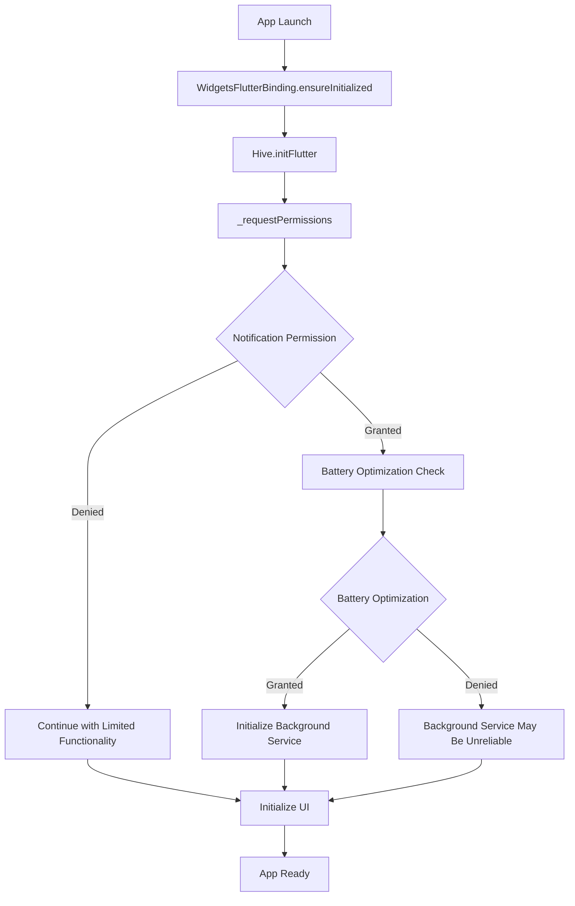

# Permission Management Documentation

## Overview

This document provides comprehensive documentation of the SoccerTimeApp's permission management system, including all declared permissions, their usage patterns, request timing, and fallback behaviors. The app requires several critical permissions for background timer functionality and file operations.

## Permission Categories

### 1. Storage Permissions

#### Legacy Storage (Android < 13)
```xml
<uses-permission android:name="android.permission.READ_EXTERNAL_STORAGE"/>
<uses-permission android:name="android.permission.WRITE_EXTERNAL_STORAGE"/>
<uses-permission android:name="android.permission.MANAGE_EXTERNAL_STORAGE" />
```

#### Scoped Storage (Android 13+)
```xml
<uses-permission android:name="android.permission.READ_MEDIA_IMAGES" />
<uses-permission android:name="android.permission.READ_MEDIA_VIDEO" />
<uses-permission android:name="android.permission.READ_MEDIA_AUDIO" />
```

**Usage:**
- Session data export (PDF generation)
- Session backup and restore
- Asset file access (images, audio)

**Request Timing:** Not currently requested at runtime (relies on manifest declaration)

**Fallback Behavior:** App continues with limited export functionality

### 2. Background Execution Permissions

#### Foreground Service
```xml
<uses-permission android:name="android.permission.FOREGROUND_SERVICE" />
<uses-permission android:name="android.permission.FOREGROUND_SERVICE_SPECIAL_USE" />
```

**Usage:**
- Background timer continuation when app is backgrounded
- Maintaining match timing accuracy during device sleep

**Request Timing:** Automatic (system-level permission)

**Fallback Behavior:** Timer continues in foreground only, may be killed by system

#### Wake Lock
```xml
<uses-permission android:name="android.permission.WAKE_LOCK" />
```

**Usage:**
- Preventing device sleep during active matches
- Maintaining timer accuracy
- Keeping screen active during gameplay

**Implementation:**
```dart
// Enable wakelock during app startup
await WakelockPlus.enable();

// Disable when app is terminated
await WakelockPlus.disable();
```

**Request Timing:** Automatic (system-level permission)

**Fallback Behavior:** Device may sleep during matches, affecting timer visibility

#### Notifications
```xml
<uses-permission android:name="android.permission.POST_NOTIFICATIONS" />
```

**Usage:**
- Background service notifications
- Period end alerts
- Match completion notifications

**Request Timing:** Startup (`_requestPermissions()`)

**Implementation:**
```dart
Future<void> _requestPermissions() async {
  // Request notification permission for background service
  final notificationStatus = await Permission.notification.request();
  print("Notification permission status: $notificationStatus");
}
```

**Fallback Behavior:** Background service may not function properly, no notifications shown

#### Battery Optimization
```xml
<uses-permission android:name="android.permission.REQUEST_IGNORE_BATTERY_OPTIMIZATIONS" />
```

**Usage:**
- Preventing system from killing background timer
- Ensuring background service reliability
- Maintaining timer accuracy during extended background periods

**Request Timing:** Startup (`_requestPermissions()`)

**Implementation:**
```dart
Future<void> _requestPermissions() async {
  // Request battery optimization permission for background service
  if (await Permission.ignoreBatteryOptimizations.isDenied) {
    await Permission.ignoreBatteryOptimizations.request();
  }
}
```

**Fallback Behavior:** Background timer may be killed by battery optimization

#### Exact Alarms
```xml
<uses-permission android:name="android.permission.SCHEDULE_EXACT_ALARM" />
<uses-permission android:name="android.permission.USE_EXACT_ALARM" />
```

**Usage:**
- Precise timer scheduling for period/match end events
- Background alarm management
- Timer synchronization

**Request Timing:** Automatic (system-level permission)

**Fallback Behavior:** Timer events may be delayed or imprecise

#### Boot Receiver
```xml
<uses-permission android:name="android.permission.RECEIVE_BOOT_COMPLETED"/>
```

**Usage:**
- Restoring timer state after device reboot (if implemented)
- Background service persistence

**Request Timing:** Automatic (system-level permission)

**Fallback Behavior:** Timer state lost after device reboot

## Permission Request Flow

### Startup Permission Sequence



### Runtime Permission Verification

Currently, the app **does not implement runtime permission re-verification**. This is a significant gap identified in the technical debt audit.

**Missing Implementation:**
- Permission status checking on app resume
- Handling of revoked permissions
- User guidance for permanently denied permissions
- Graceful degradation when permissions are unavailable

## Permission Usage Analysis

### Current Usage Patterns

#### Notification Permission
```dart
// CURRENT: Basic request at startup
final notificationStatus = await Permission.notification.request();

// MISSING: Runtime verification
// MISSING: Fallback handling
// MISSING: User education about importance
```

#### Battery Optimization Permission
```dart
// CURRENT: Simple check and request
if (await Permission.ignoreBatteryOptimizations.isDenied) {
  await Permission.ignoreBatteryOptimizations.request();
}

// MISSING: User explanation of why this is needed
// MISSING: Handling of permanent denial
// MISSING: Alternative strategies if denied
```

### Permission Dependencies

#### Background Timer Functionality
**Required Permissions:**
- `FOREGROUND_SERVICE` (critical)
- `POST_NOTIFICATIONS` (critical)
- `REQUEST_IGNORE_BATTERY_OPTIMIZATIONS` (important)
- `WAKE_LOCK` (important)

**Dependency Chain:**
```
Background Timer → Foreground Service → Notifications
                ↓
         Battery Optimization Exemption
                ↓
            Wake Lock
```

#### File Operations
**Required Permissions:**
- `READ_EXTERNAL_STORAGE` / `READ_MEDIA_*` (for imports)
- `WRITE_EXTERNAL_STORAGE` / `MANAGE_EXTERNAL_STORAGE` (for exports)

**Usage Context:**
- PDF export functionality
- Session backup/restore
- Asset file access

## Permission-Related Issues

### Current Problems

1. **No Runtime Verification**
   - Permissions not re-checked on app resume
   - No handling of revoked permissions
   - App may fail silently if permissions are removed

2. **Poor User Education**
   - No explanation of why permissions are needed
   - No guidance for users who deny permissions
   - No clear indication of reduced functionality

3. **Inadequate Error Handling**
   - No graceful degradation when permissions are denied
   - Background service may fail without clear user feedback
   - No recovery mechanisms for permission-related failures

4. **Missing Fallback Strategies**
   - No foreground-only mode when background permissions are denied
   - No alternative notification methods
   - No reduced-functionality modes

### Recommended Improvements

#### 1. Implement Permission Manager

```dart
class PermissionManager {
  static Future<PermissionAuditResult> checkAllPermissions() async {
    final results = <Permission, PermissionStatus>{};
    
    // Check critical permissions
    results[Permission.notification] = await Permission.notification.status;
    results[Permission.ignoreBatteryOptimizations] = 
        await Permission.ignoreBatteryOptimizations.status;
    
    return PermissionAuditResult(
      currentStatus: results,
      missingPermissions: _findMissingPermissions(results),
      permanentlyDenied: _findPermanentlyDenied(results),
    );
  }
  
  static Future<bool> requestMissingPermissions() async {
    final audit = await checkAllPermissions();
    
    for (final permission in audit.missingPermissions) {
      final status = await permission.request();
      if (status.isDenied) {
        await _handlePermissionDenied(permission);
      }
    }
    
    return audit.allRequiredGranted;
  }
}
```

#### 2. Runtime Permission Verification

```dart
@override
void didChangeAppLifecycleState(AppLifecycleState state) {
  if (state == AppLifecycleState.resumed) {
    // Verify permissions on resume
    _verifyPermissionsOnResume();
  }
}

Future<void> _verifyPermissionsOnResume() async {
  final audit = await PermissionManager.checkAllPermissions();
  
  if (!audit.allRequiredGranted) {
    await _handleMissingPermissions(audit);
  }
}
```

#### 3. User Education and Guidance

```dart
Future<void> _showPermissionEducationDialog(Permission permission) async {
  final message = _getPermissionExplanation(permission);
  
  await showDialog(
    context: context,
    builder: (context) => AlertDialog(
      title: Text('Permission Required'),
      content: Text(message),
      actions: [
        TextButton(
          onPressed: () => Navigator.pop(context),
          child: Text('Cancel'),
        ),
        TextButton(
          onPressed: () {
            Navigator.pop(context);
            openAppSettings();
          },
          child: Text('Open Settings'),
        ),
      ],
    ),
  );
}

String _getPermissionExplanation(Permission permission) {
  switch (permission) {
    case Permission.notification:
      return 'Notifications are required to show timer alerts when the app is in the background.';
    case Permission.ignoreBatteryOptimizations:
      return 'Battery optimization exemption ensures the timer continues running accurately when your device is locked.';
    default:
      return 'This permission is required for the app to function properly.';
  }
}
```

#### 4. Graceful Degradation

```dart
class AppMode {
  final bool backgroundTimerAvailable;
  final bool notificationsAvailable;
  final bool exportAvailable;
  
  AppMode({
    required this.backgroundTimerAvailable,
    required this.notificationsAvailable,
    required this.exportAvailable,
  });
  
  factory AppMode.fromPermissions(PermissionAuditResult audit) {
    return AppMode(
      backgroundTimerAvailable: audit.hasNotificationPermission && 
                               audit.hasBatteryOptimizationExemption,
      notificationsAvailable: audit.hasNotificationPermission,
      exportAvailable: audit.hasStoragePermissions,
    );
  }
}
```

## Android Manifest Analysis

### Service Declarations

#### Foreground Service
```xml
<service
    android:name="com.pravera.flutter_background.service.ForegroundService"
    android:foregroundServiceType="specialUse"
    android:exported="false"
    tools:ignore="ForegroundServicePermission" />
```

**Analysis:**
- Uses `specialUse` service type for timer functionality
- Not exported (internal use only)
- Ignores foreground service permission warning (may need review)

#### Alarm Manager Service
```xml
<service
    android:name="dev.fluttercommunity.plus.androidalarmmanager.AlarmService"
    android:permission="android.permission.BIND_JOB_SERVICE"
    android:exported="false"/>
```

**Analysis:**
- Handles exact alarm scheduling
- Requires job service binding permission
- Used for precise timer events

### Receiver Declarations

#### Alarm Broadcast Receiver
```xml
<receiver
    android:name="dev.fluttercommunity.plus.androidalarmmanager.AlarmBroadcastReceiver"
    android:exported="false"/>
```

#### Boot Receiver (Disabled)
```xml
<receiver
    android:name="dev.fluttercommunity.plus.androidalarmmanager.RebootBroadcastReceiver"
    android:enabled="false"
    android:exported="false">
    <intent-filter>
        <action android:name="android.intent.action.BOOT_COMPLETED" />
    </intent-filter>
</receiver>
```

**Analysis:**
- Boot receiver is currently disabled
- Would allow timer restoration after device reboot
- Consider enabling for better user experience

## Security Considerations

### Permission Minimization

**Current State:** App requests broad storage permissions that may not be fully utilized

**Recommendations:**
1. Audit actual storage usage patterns
2. Consider using scoped storage APIs instead of broad permissions
3. Request permissions only when needed (just-in-time)

### Privacy Implications

**Notification Permission:**
- Required for background functionality
- No sensitive data in notifications
- User can disable in system settings

**Battery Optimization:**
- Necessary for timer accuracy
- No privacy implications
- User retains control through system settings

**Storage Permissions:**
- Used for session export/import
- No access to user's personal files
- Consider using document picker instead

## Testing Recommendations

### Permission Testing Scenarios

1. **Fresh Install Testing**
   - Test permission request flow on new installation
   - Verify app behavior when permissions are denied
   - Test graceful degradation modes

2. **Runtime Permission Changes**
   - Revoke permissions while app is running
   - Test app resume after permission changes
   - Verify error handling and recovery

3. **Battery Optimization Testing**
   - Test timer accuracy with battery optimization enabled/disabled
   - Verify background service behavior under different power modes
   - Test on various Android versions and OEM customizations

4. **Edge Case Testing**
   - Test with all permissions denied
   - Test with partial permission grants
   - Test permission request failures

### Automated Testing

```dart
// Example permission testing
testWidgets('App handles denied notification permission gracefully', (tester) async {
  // Mock permission denial
  when(mockPermissionHandler.request(Permission.notification))
      .thenAnswer((_) async => PermissionStatus.denied);
  
  await tester.pumpWidget(MyApp());
  
  // Verify app continues with limited functionality
  expect(find.text('Background timer unavailable'), findsOneWidget);
});
```

## Migration Strategy

### Implementing Improved Permission Management

1. **Phase 1: Add Permission Manager**
   - Create centralized permission management class
   - Implement permission status checking
   - Add basic error handling

2. **Phase 2: Runtime Verification**
   - Add permission checking on app resume
   - Implement permission change detection
   - Add user notification for permission issues

3. **Phase 3: User Education**
   - Add permission explanation dialogs
   - Implement settings guidance
   - Create help documentation

4. **Phase 4: Graceful Degradation**
   - Implement reduced functionality modes
   - Add fallback strategies
   - Improve error messaging

### Backward Compatibility

- Maintain existing permission declarations
- Ensure new permission logic doesn't break existing functionality
- Provide migration path for users with existing permission states

## Monitoring and Analytics

### Permission Metrics to Track

1. **Permission Grant Rates**
   - Percentage of users granting each permission
   - Permission denial patterns
   - Permanent denial rates

2. **Functionality Impact**
   - Background timer reliability with/without permissions
   - Export functionality usage
   - User retention based on permission status

3. **Error Rates**
   - Permission-related crashes
   - Background service failures
   - Timer accuracy issues

### Implementation

```dart
class PermissionAnalytics {
  static void trackPermissionRequest(Permission permission, PermissionStatus result) {
    // Track permission request outcomes
    analytics.logEvent('permission_requested', {
      'permission': permission.toString(),
      'result': result.toString(),
      'timestamp': DateTime.now().toIso8601String(),
    });
  }
  
  static void trackPermissionImpact(String functionality, bool available) {
    // Track functionality availability based on permissions
    analytics.logEvent('functionality_availability', {
      'feature': functionality,
      'available': available,
      'timestamp': DateTime.now().toIso8601String(),
    });
  }
}
```