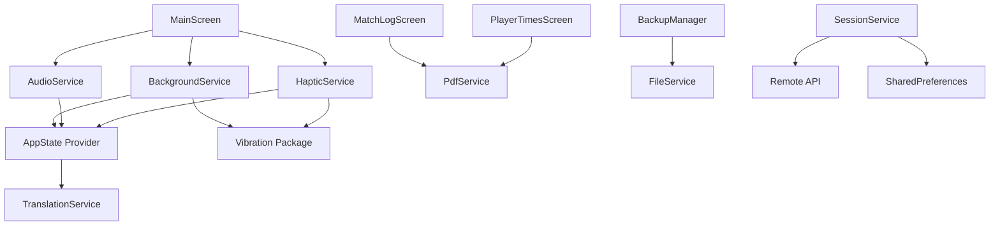
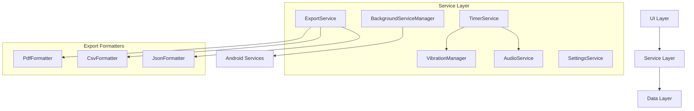

# Service Layer Architecture Documentation

## Overview

The SoccerTimeApp service layer consists of 7 service classes that handle various aspects of the application's business logic and system integration. This document provides a comprehensive analysis of the current service architecture, responsibilities, and recommendations for improvement.

## Service Architecture Summary

| Service | Lines of Code | Primary Responsibility | Complexity | SRP Score |
|---------|---------------|------------------------|-------------|-----------|
| `BackgroundService` | 1,233 | Timer + Background execution | ⚠️ **Critical** | 1/10 |
| `PdfService` | 1,176 | PDF generation + UI rendering | ⚠️ **High** | 4/10 |
| `AudioService` | ~150 | Audio playback management | ✅ **Low** | 8/10 |
| `HapticService` | ~200 | Haptic feedback coordination | ⚠️ **Medium** | 6/10 |
| `FileService` | ~250 | File export operations | ✅ **Low** | 7/10 |
| `SessionService` | ~300 | Remote + local storage | ⚠️ **Medium** | 5/10 |
| `TranslationService` | ~100 | Internationalization | ✅ **Low** | 9/10 |

## Detailed Service Analysis

### 1. BackgroundService
**File**: `lib/services/background_service.dart` | **Size**: 1,233 lines | **Complexity**: ⚠️ **CRITICAL**

#### Primary Responsibilities (SRP Violation - 7 distinct concerns):
1. **Timer Management**: Wall-clock based timer with precision tracking
2. **Background Service Lifecycle**: Android foreground service management  
3. **Time Synchronization**: Complex background/foreground sync algorithms
4. **Vibration Control**: Period and match end haptic feedback
5. **State Persistence**: SharedPreferences for timer state
6. **UI Notifications**: Direct AppState updates and listener callbacks
7. **Alarm Scheduling**: Android AlarmManager integration

#### Key Methods:
- `initialize()` - Service setup and permissions
- `startBackgroundTimer()` - **113 lines** - Timer initialization with drift compensation
- `syncTimeOnResume()` - **~80 lines** - Background synchronization logic
- `_notifyTimeUpdate()`, `_notifyPeriodEnd()`, `_notifyMatchEnd()` - UI callbacks

#### Dependencies:
```dart
// External packages
import 'package:shared_preferences/shared_preferences.dart';
import 'package:android_alarm_manager_plus/android_alarm_manager_plus.dart';
import 'package:flutter_background/flutter_background.dart';
import 'package:vibration/vibration.dart';
import 'package:permission_handler/permission_handler.dart';

// Internal dependencies  
import '../providers/app_state.dart'; // TIGHT COUPLING
```

#### Architectural Issues:
- **Massive Class**: 1,233 lines violates single responsibility principle
- **Tight Coupling**: Direct dependency on AppState provider
- **Complex State Management**: Multiple boolean flags and timing variables
- **Mixed Concerns**: Timer logic intertwined with Android service management
- **Difficult Testing**: Complex dependencies make unit testing challenging

#### Consumers:
- `lib/main.dart` - Global initialization
- `lib/screens/main_screen.dart` - Timer control integration
- `lib/providers/app_state.dart` - Bidirectional communication

---

### 2. PdfService  
**File**: `lib/services/pdf_service.dart` | **Size**: 1,176 lines | **Complexity**: ⚠️ **HIGH**

#### Primary Responsibilities (SRP Violation - 4 distinct concerns):
1. **PDF Document Generation**: Match logs and player reports
2. **Icon Creation**: SVG/PNG to PDF icon conversion with caching
3. **Canvas Rendering**: Complex UI drawing operations
4. **File Management**: Temporary file creation and sharing

#### Key Methods:
- `generateMatchLogPdf()` - Match timeline PDF with events
- `generatePlayerTimesPdf()` - Player statistics report
- `_createSoccerBallFromPng()`, `_createWhistleFromSvg()` - Icon rendering
- `_cleanSessionNameForPdf()` - Text processing utilities

#### Dependencies:
```dart
import 'package:pdf/pdf.dart';
import 'package:pdf/widgets.dart' as pw;
import 'package:path_provider/path_provider.dart';
import 'package:flutter/services.dart'; // Asset loading
import 'dart:ui' as ui; // Canvas operations
```

#### Architectural Issues:
- **Large Class**: 1,176 lines combining PDF generation with UI rendering
- **Multiple Responsibilities**: Document creation, icon caching, file operations
- **Complex Rendering Logic**: Manual Canvas drawing mixed with business logic
- **Resource Management**: Icon caching without disposal patterns

#### Consumers:
- `lib/screens/match_log_screen.dart` - Match report generation
- `lib/screens/player_times_screen.dart` - Player statistics export

---

### 3. AudioService
**File**: `lib/services/audio_service.dart` | **Size**: ~150 lines | **Complexity**: ✅ **LOW**

#### Primary Responsibility:
- **Audio Playback Management**: Whistle sound effects

#### Key Methods:
- `_init()` - Pre-load audio assets for performance
- `playWhistle()` - Conditional audio playback based on settings
- `setContext()` - BuildContext injection for AppState access

#### Dependencies:
```dart
import 'package:audioplayers/audioplayers.dart';
import 'package:provider/provider.dart';
import '../providers/app_state.dart';
```

#### Architectural Issues:
- **Context Dependency**: Requires manual BuildContext injection
- **Settings Coupling**: Direct access to AppState for audio settings
- **Limited Functionality**: Only supports single audio type (whistle)

#### Consumers:
- `lib/screens/main_screen.dart` - Period/match end audio cues

---

### 4. HapticService
**File**: `lib/services/haptic_service.dart` | **Size**: ~200 lines | **Complexity**: ⚠️ **MEDIUM**

#### Primary Responsibility:
- **Haptic Feedback Coordination**: Vibration patterns for different UI interactions

#### Key Methods:
- `playerToggle()`, `matchPause()`, `matchStart()`, `periodEnd()` - Specific vibration patterns
- `_isVibrationEnabled()` - Settings validation through AppState
- Pattern definitions for different interaction types

#### Dependencies:
```dart
import 'package:vibration/vibration.dart';
import 'package:provider/provider.dart';
import '../providers/app_state.dart';
```

#### Architectural Issues:
- **Context Dependency**: All methods require BuildContext parameter
- **Overlapping Functionality**: Duplicates vibration logic from BackgroundService
- **Hardcoded Patterns**: Vibration patterns could be data-driven
- **Settings Coupling**: Direct AppState access for vibration settings

#### Consumers:
- `lib/screens/main_screen.dart` - UI interaction feedback

---

### 5. FileService
**File**: `lib/services/file_service.dart` | **Size**: ~250 lines | **Complexity**: ✅ **LOW**

#### Primary Responsibility:
- **File Export Operations**: CSV export and backup functionality

#### Key Methods:
- `exportToCsv()` - Player time data to CSV format
- `backupSession()` - JSON session backup creation
- `restoreSession()` - **STUB**: Commented out due to removed dependency

#### Dependencies:
```dart
import 'package:csv/csv.dart';
import 'package:path_provider/path_provider.dart';
import 'package:share_plus/share_plus.dart';
```

#### Architectural Issues:
- **Incomplete Implementation**: Restore functionality is stubbed out
- **Hardcoded Paths**: Direct Android Downloads folder access
- **Limited Format Support**: Only CSV export implemented

#### Consumers:
- `lib/utils/backup_manager.dart` - Session backup operations

---

### 6. SessionService  
**File**: `lib/services/session_service.dart` | **Size**: ~300 lines | **Complexity**: ⚠️ **MEDIUM**

#### Primary Responsibilities (SRP Violation - 3 distinct concerns):
1. **Remote API Communication**: Session CRUD operations
2. **Local Storage Management**: SharedPreferences for credentials
3. **Theme Preference Storage**: App theme persistence

#### Key Methods:
- `checkSessionExists()`, `loadSession()`, `saveSession()` - Remote operations
- `saveSessionPassword()`, `loadSessionPassword()` - Credential management
- `saveTheme()`, `loadTheme()` - Theme persistence

#### Dependencies:
```dart
import 'package:http/http.dart' as http;
import 'package:shared_preferences/shared_preferences.dart';
```

#### Architectural Issues:
- **Mixed Responsibilities**: Remote API + local storage + theme management
- **Hardcoded Configuration**: API endpoints not configurable (`localhost:8000`)
- **Unused Complexity**: Remote session features appear unused
- **No Error Handling**: HTTP operations lack proper error handling

#### Consumers:
- **None detected** - Service appears largely unused in current codebase

---

### 7. TranslationService
**File**: `lib/services/translation_service.dart` | **Size**: ~100 lines | **Complexity**: ✅ **LOW**

#### Primary Responsibility:
- **Internationalization Support**: Translation key lookup with hardcoded English translations

#### Key Methods:
- `get(String key)` - Translation key to text lookup
- `init()` - No-op initialization method  
- `tr()` - BuildContext extension method for convenience

#### Dependencies:
```dart
import 'package:flutter/material.dart';
```

#### Architectural Issues:
- **Limited Functionality**: Only English translations hardcoded
- **Static Implementation**: No dynamic loading or multiple language support
- **Minimal Usage**: Only basic translation keys implemented

#### Consumers:
- `lib/providers/app_state.dart` - Match event translations
- Multiple screen files - UI text translations

## Service Interaction Analysis

### Current Service Dependencies



### Problematic Coupling Patterns

1. **Bidirectional Coupling**: BackgroundService ↔ AppState
2. **Context Dependencies**: AudioService and HapticService require BuildContext
3. **Duplicate Dependencies**: BackgroundService and HapticService both use vibration
4. **Unused Services**: SessionService has no active consumers

## Service Consolidation Opportunities

### High Priority Consolidations

#### 1. Vibration Management Consolidation
**Problem**: BackgroundService and HapticService both handle vibration
```dart
// Current duplication:
// BackgroundService.dart - Lines 850-900
// HapticService.dart - Lines 50-150
```

**Solution**: Extract unified `VibrationManager`
```dart
class VibrationManager {
  static final Map<VibrationPattern, List<int>> patterns = {
    VibrationPattern.playerToggle: [100],
    VibrationPattern.periodEnd: [500, 100, 500],
    VibrationPattern.matchEnd: [1000, 200, 1000, 200, 1000],
  };
  
  static Future<void> trigger(VibrationPattern pattern) async {
    if (await _isEnabled()) {
      await Vibration.vibrate(pattern: patterns[pattern]);
    }
  }
}
```

#### 2. Timer Logic Extraction  
**Problem**: BackgroundService combines timer logic with service management
```dart
// Current: 1,233 lines mixing concerns
// Timer logic: ~600 lines
// Service management: ~400 lines  
// Vibration/UI: ~233 lines
```

**Solution**: Extract `TimerService` and `BackgroundServiceManager`
```dart
class TimerService {
  Stream<int> get timeUpdates;
  void start(int initialTime);
  void pause();
  void resume();
  int get currentTime;
}

class BackgroundServiceManager {
  Future<void> startForegroundService();
  Future<void> stopForegroundService();
  void handleAppLifecycle(AppLifecycleState state);
}
```

#### 3. Export Service Unification
**Problem**: PdfService and FileService handle different export formats separately
```dart
// PdfService: 1,176 lines
// FileService: ~250 lines
```

**Solution**: Unified `ExportService` with format providers
```dart
abstract class ExportFormatter {
  Future<String> export(ExportData data);
}

class ExportService {
  final Map<ExportFormat, ExportFormatter> formatters;
  
  Future<String> export(ExportData data, ExportFormat format) {
    return formatters[format]!.export(data);
  }
}
```

### Medium Priority Consolidations

#### 4. Settings Management Centralization
**Problem**: Multiple services check settings through AppState
```dart
// AudioService checks enableSound
// HapticService checks enableVibration  
// SessionService manages theme
```

**Solution**: Reactive `SettingsService`
```dart
class SettingsService extends ChangeNotifier {
  bool get enableSound;
  bool get enableVibration;
  ThemeMode get theme;
  
  Stream<SettingChange> get changes;
}
```

## Recommended Service Architecture

### Target Architecture Diagram



### Service Responsibility Matrix (Target)

| Service | Primary Responsibility | Max Lines | Dependencies |
|---------|------------------------|-----------|--------------|
| `TimerService` | Precise time tracking only | 300 | None |
| `BackgroundServiceManager` | Android service lifecycle | 200 | Android APIs |
| `VibrationManager` | Unified haptic feedback | 100 | Vibration package |
| `AudioService` | Audio playback | 150 | AudioPlayers |
| `ExportService` | Format-agnostic export | 200 | Formatters |
| `SettingsService` | Centralized preferences | 150 | SharedPreferences |
| `TranslationService` | i18n support | 200 | Asset loading |

### Implementation Roadmap

#### Phase 1: Critical Extractions (2-3 weeks)
1. Extract `TimerService` from `BackgroundService`
2. Create `VibrationManager` consolidation  
3. Split `BackgroundServiceManager` responsibilities

#### Phase 2: Service Unification (1-2 weeks)  
1. Implement unified `ExportService` with formatters
2. Create reactive `SettingsService`
3. Remove context dependencies from services

#### Phase 3: Dependency Injection (1 week)
1. Implement service locator pattern
2. Remove direct AppState coupling  
3. Create service composition root

## Testing Strategy

### Unit Testing Targets
- **TimerService**: Isolated timer logic testing
- **VibrationManager**: Pattern validation and setting integration
- **ExportService**: Format-specific output validation
- **SettingsService**: Reactive updates and persistence

### Integration Testing
- **Service Lifecycle**: Proper initialization and disposal
- **Background Service**: App lifecycle state transitions
- **Export Workflows**: End-to-end export functionality

## Success Metrics

### Before Refactoring
- **Largest Service**: 1,233 lines (BackgroundService)
- **SRP Violations**: 3 critical services
- **Service Coupling**: High (bidirectional dependencies)
- **Context Dependencies**: 2 services require BuildContext

### After Refactoring Targets  
- **Largest Service**: <400 lines
- **SRP Violations**: 0 critical services
- **Service Coupling**: Low (unidirectional dependencies)
- **Context Dependencies**: 0 services require BuildContext

## Conclusion

The SoccerTimeApp service layer exhibits significant architectural debt with the BackgroundService class being the primary concern. A systematic refactoring approach focusing on single responsibility principle, dependency inversion, and proper service boundaries will dramatically improve maintainability and testability.

**Priority**: Begin with BackgroundService decomposition as it impacts the entire application's timer functionality and represents the highest technical debt in the service layer.