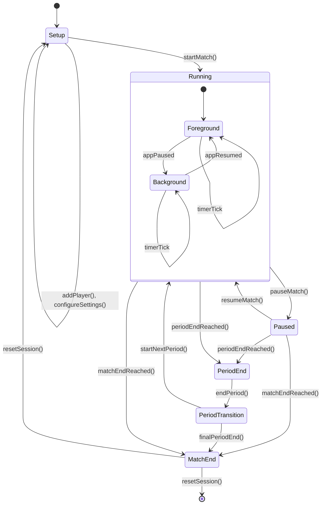
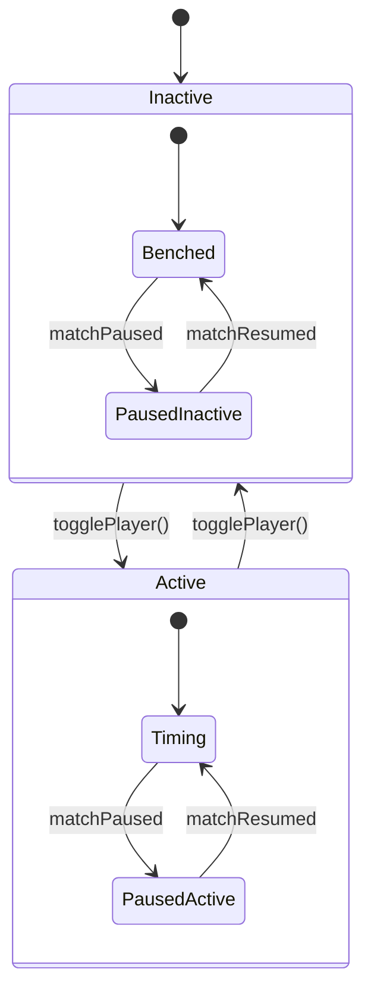
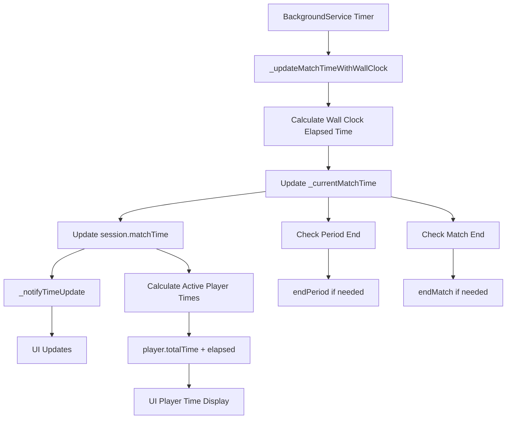
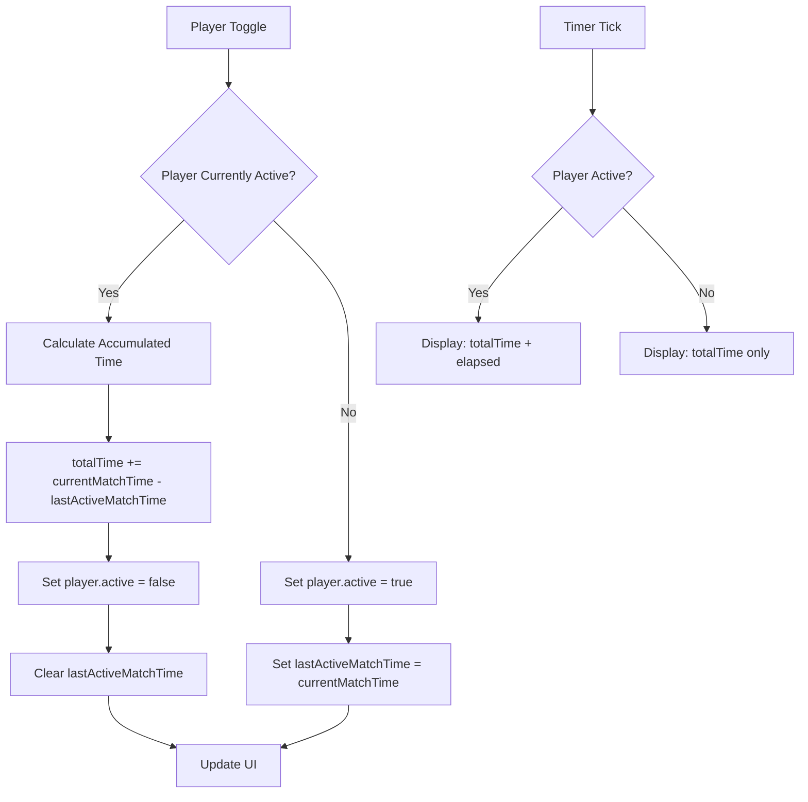
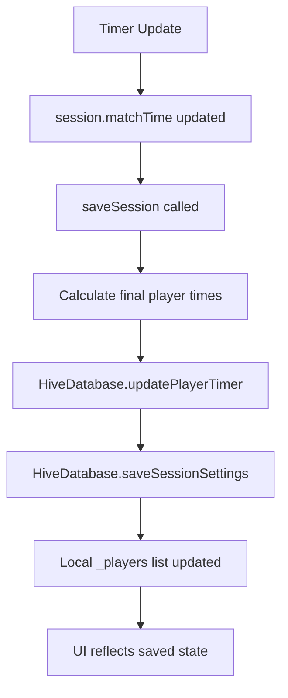

# Timer State Machine and Data Flow Documentation

## Overview

This document provides comprehensive documentation of the SoccerTimeApp timer behavior, state transitions, and data flow architecture. The timer system manages both match timing and individual player timing with complex synchronization between background and foreground states.

## Timer Architecture Components

### Core Components

1. **BackgroundService** (`lib/services/background_service.dart`)
   - Manages background timer execution
   - Handles foreground/background synchronization
   - Coordinates with Android system services

2. **AppState** (`lib/providers/app_state.dart`)
   - Manages application state and UI updates
   - Coordinates player state changes
   - Handles session persistence

3. **Session Model** (`lib/models/session.dart`)
   - Contains match timing data
   - Manages player states and timing
   - Tracks match periods and segments

4. **Player Model** (`lib/models/player.dart`)
   - Individual player timing data
   - Active/inactive state tracking
   - Goal tracking

## Timer State Machine

### Master Match Timer States



### Individual Player Timer States



## Complete Timer Lifecycle

### 1. Setup Phase

**State**: `session.isSetup = true`

**Characteristics**:
- Timer is initialized but not counting
- Players can be added/removed
- Match settings can be configured
- No time accumulation occurs

**Key Variables**:
```dart
session.isSetup = true
session.matchTime = 0
session.matchRunning = false
backgroundService._isTimerActive = false
```

### 2. Running Phase

**State**: `session.isSetup = false`, `session.matchRunning = true`, `session.isPaused = false`

**Characteristics**:
- Match timer actively counting
- Active players accumulating time
- Background service monitoring for period/match end
- UI updates every second

**Key Variables**:
```dart
session.isSetup = false
session.matchRunning = true
session.isPaused = false
backgroundService._isTimerActive = true
```

**Timer Update Flow**:
1. `BackgroundService._backgroundTimer` fires every 1 second
2. `_updateMatchTimeWithWallClock()` calculates elapsed time using wall clock
3. `session.matchTime` updated with new value
4. `_notifyTimeUpdate()` triggers UI updates
5. Active players' time calculated: `totalTime + (currentMatchTime - lastActiveMatchTime)`

### 3. Paused Phase

**State**: `session.isPaused = true`

**Characteristics**:
- Match timer stopped
- Player times frozen at current values
- Active players stored in `activeBeforePause` list
- Background service timer inactive

**Key Variables**:
```dart
session.isPaused = true
session.matchRunning = false
backgroundService._isTimerActive = false
session.activeBeforePause = [list of active player names]
```

**Pause Process**:
1. Current active players identified
2. Player accumulated times calculated and stored
3. Players deactivated (`player.active = false`)
4. Player names stored in `activeBeforePause`
5. Background timer stopped

### 4. Period End Phase

**State**: `session.hasWhistlePlayed = true`, `periodsTransitioning = true`

**Characteristics**:
- Match timer stopped at exact period end time
- Players paused automatically
- Period transition dialog shown
- Waiting for user to start next period

**Key Variables**:
```dart
session.hasWhistlePlayed = true
session.isPaused = true
appState.periodsTransitioning = true
session.matchTime = exactPeriodEndTime
```

**Period End Process**:
1. Timer reaches calculated period end time
2. `endPeriod()` called automatically
3. Match time set to exact period boundary
4. All active players paused and stored
5. Period transition flag set
6. UI shows period transition dialog

### 5. Period Transition Phase

**State**: `periodsTransitioning = true`

**Characteristics**:
- Between periods
- Timer stopped
- Players can be substituted
- Waiting for next period start

**Transition Process**:
1. User clicks "Start Next Period"
2. `startNextPeriod()` called
3. Period counter incremented
4. Previously active players reactivated
5. Timer resumes from period boundary
6. Transition flag cleared

### 6. Match End Phase

**State**: `session.isMatchComplete = true`

**Characteristics**:
- Final timer state
- All timing stopped
- Match summary available
- Session can be reset or saved

**Key Variables**:
```dart
session.isMatchComplete = true
session.matchTime = session.matchDuration
session.matchRunning = false
```

## Background/Foreground Timer Synchronization

### Background Entry Process

When app goes to background:

```dart
// Store current state for synchronization
_backgroundEntryTime = DateTime.now().millisecondsSinceEpoch
_lastKnownMatchTime = session.matchTime
_referenceWallTime = DateTime.now()
_referenceMatchTime = _currentMatchTime
```

### Background Timer Operation

While in background:
1. `_backgroundTimer` continues running every 1 second
2. `_updateMatchTimeWithWallClock()` uses wall clock as source of truth
3. Time calculated as: `referenceMatchTime + (now - referenceWallTime)`
4. Period/match end detection continues
5. Android notification updated periodically

### Foreground Resume Process

When app returns to foreground:

```dart
void syncTimeOnResume(AppState appState) {
  // Calculate elapsed time in background
  final elapsedMillis = nowMillis - _backgroundEntryTime + 500; // +500ms compensation
  final expectedMatchTime = (_lastKnownMatchTime * 1000 + elapsedMillis) / 1000
  
  // Update match time with calculated value
  _currentMatchTime = expectedMatchTime.round()
  appState.session.matchTime = _currentMatchTime
  
  // Reset timing references for clean restart
  _referenceWallTime = DateTime.now()
  _referenceMatchTime = _currentMatchTime
  _partialSeconds = 0.0
}
```

## Data Flow Architecture

### Primary Data Flow



### Player Time Calculation Flow



### Database Persistence Flow



## Critical Timer Requirements

### Accuracy Requirements

1. **Timer Precision**: Must maintain accuracy within ±1 second over match duration
2. **Background Continuity**: Timer must continue when phone sleeps/app backgrounded
3. **Synchronization**: Foreground/background time must sync without drift
4. **Period Boundaries**: Must stop exactly at calculated period end times

### Background Operation Requirements

1. **Android Foreground Service**: Required for background timer operation
2. **Notification Permission**: Required for foreground service notification
3. **Battery Optimization**: Must request exemption for reliable background operation
4. **Wake Lock**: Prevents device sleep during active timing

### State Consistency Requirements

1. **Single Source of Truth**: Wall clock time used as authoritative time source
2. **Atomic Updates**: State changes must be atomic to prevent inconsistencies
3. **Recovery**: Must handle app crashes and unexpected termination gracefully
4. **Persistence**: All timing state must be persisted to survive app restarts

## Timing Reference System

### Wall Clock Synchronization

The timer system uses wall clock time as the authoritative source:

```dart
// Reference points established at timer start
_referenceWallTime = DateTime.now()
_referenceMatchTime = _currentMatchTime

// Time calculation on each tick
final elapsedSecs = (DateTime.now().millisecondsSinceEpoch - _referenceWallTime.millisecondsSinceEpoch) / 1000.0
final targetMatchTime = (_referenceMatchTime + elapsedSecs).round()
```

### Drift Correction

Every 20 seconds, authoritative time sync occurs:

```dart
void _performAuthoritativeTimeSync() {
  final expectedTime = calculateExpectedTimeFromWallClock()
  final drift = expectedTime - _currentMatchTime
  
  if (drift.abs() >= 1.0) {
    _currentMatchTime = expectedTime
    // Reset references for next interval
    _referenceWallTime = DateTime.now()
    _referenceMatchTime = _currentMatchTime
  }
}
```

## Error Handling and Edge Cases

### Background Service Failures

1. **Service Start Failure**: Fallback to foreground-only timing
2. **Permission Denied**: User guidance to enable required permissions
3. **Battery Optimization**: Request exemption with user education

### Time Synchronization Issues

1. **Clock Changes**: System clock changes detected and handled
2. **Negative Elapsed Time**: References reset on detection
3. **Large Drift**: Automatic correction with logging

### State Recovery

1. **App Crash**: Session state restored from database on restart
2. **Background Kill**: Timer state reconstructed from last known values
3. **Database Corruption**: Graceful degradation with error reporting

## Performance Considerations

### Memory Management

1. **Timer Cleanup**: All timers properly cancelled on stop
2. **Listener Management**: Event listeners added/removed appropriately
3. **Reference Cleanup**: Timing references reset to prevent memory leaks

### Battery Optimization

1. **Efficient Updates**: UI updates throttled to necessary frequency
2. **Background Efficiency**: Minimal processing in background timer
3. **Service Lifecycle**: Proper service start/stop to minimize battery drain

### UI Responsiveness

1. **Non-blocking Updates**: Timer calculations don't block UI thread
2. **Efficient Rendering**: Only necessary UI components updated on timer tick
3. **State Batching**: Multiple state changes batched into single UI update

## Testing Considerations

### Unit Testing Focus Areas

1. **Time Calculations**: Verify accuracy of elapsed time calculations
2. **State Transitions**: Test all timer state changes
3. **Edge Cases**: Test boundary conditions and error scenarios

### Integration Testing

1. **Background/Foreground**: Test app lifecycle transitions
2. **Long Duration**: Test timer accuracy over extended periods
3. **System Integration**: Test with Android system services

### Performance Testing

1. **Memory Leaks**: Monitor for timer-related memory leaks
2. **Battery Impact**: Measure background service efficiency
3. **Accuracy Drift**: Test timer accuracy over match duration